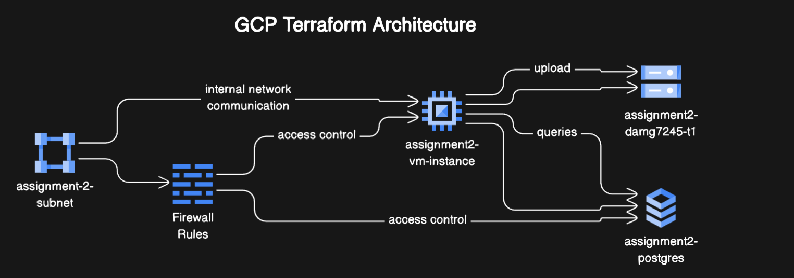
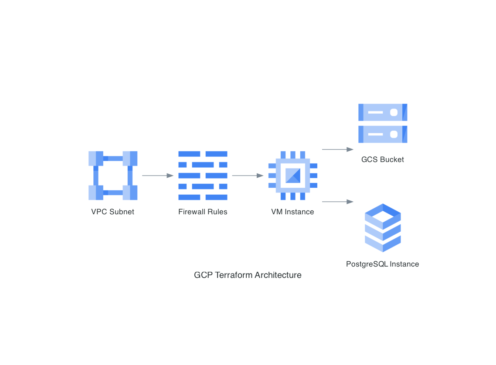

# GCP-Terraform-Infra-Setup

This repository contains Terraform scripts for provisioning and managing infrastructure on Google Cloud Platform (GCP).

## Project Overview




These Terraform scripts set up a complete infrastructure stack on GCP, including:

- A Google Cloud Storage bucket
- A PostgreSQL database instance
- A Compute Engine VM instance
- VPC networking and firewall rules

## File Structure

- `main.tf`: Configures the Google Cloud provider and sets up credentials
- `bucket.tf`: Creates a Google Cloud Storage bucket
- `sql.tf`: Provisions a PostgreSQL database instance and database
- `vm.tf`: Sets up a Compute Engine VM instance
- `vpc.tf`: Configures the VPC subnet
- `firewall.tf`: Defines firewall rules for the network

## Prerequisites

Before you begin, ensure you have the following:

1. A Google Cloud Platform account
2. Terraform installed on your local machine (version 0.12+)
3. Google Cloud SDK installed and configured
4. A GCP service account key with necessary permissions

## Setup and Usage

1. Clone this repository:   ```
   git clone https://github.com/your-username/GCP-TF-Scripts.git
   cd GCP-TF-Scripts   ```

2. Set up your Google Cloud credentials:
   - Create a service account key file in the GCP Console
   - Save the key file securely on your local machine
   -  Create a `terraform.tfvars` file and give -- `google_credentials = "path_to_credentials"`

3. Initialize Terraform:   ```
   terraform init   ```

4. Review the planned changes:   ```
   terraform plan  ```

5. Apply the changes:   ```
   terraform apply```

## Resource Details




### Storage Bucket
- Name: "assignment2-damg7245-t1"
- Location: US East (South Carolina)
- Storage Class: Standard

### PostgreSQL Database
- Instance Name: "assignment2-postgres"
- Version: PostgreSQL 13
- Tier: db-f1-micro (customizable)
- Database Name: "assignment2"

### Compute Engine VM
- Name: "assignment2-vm-instance"
- Machine Type: e2-standard-2
- Boot Disk: Ubuntu 20.04 LTS
- Zone: us-east1-c

### Networking
- Subnet: "assignment-2-subnet" (10.0.0.0/24)
- Firewall: Allows all TCP traffic (0-65535) from any source

## Outputs

After applying the Terraform configuration, you'll receive the following outputs:

- PostgreSQL instance connection name
- PostgreSQL public IP address
- Database username
- Database password (sensitive)

A `db_credentials.txt` file will also be created locally with database connection details.


### Development and Testing Setup

The current configuration is optimized for development and testing purposes:
- Open firewall rules allow unrestricted access
- Simple service account permissions for quick setup

Remember to thoroughly test all security configurations before deploying to production.

## Cleanup

To destroy all created resources and avoid unnecessary charges:
`terraform destroy`
